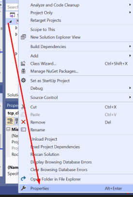
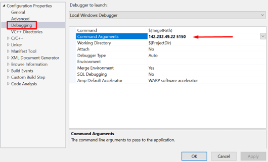

# Visual-Studio-Debugging
A short tutorial on investigating data values in Visual Studio. This guide takes the user through breakpoints and command-line arguments in debugging a winsock app which uses the overlapped I/O model with callback routines and a TCP Client.

To get started, open a Visual Studio windows console application, copy and paste the code, and run the program as explained in each instruction period.

Disclaimer: I take absolutely no credit for the code samples. All sample code is credited to Aman Abdulla from the British Columbia Institute of Technology. Also, your machine's outputs may be different due to port number allocations and memory addresses, this is to be expected (please use this document as a reference for debugging and not an pure follow along guide).

# Debugging callback.c

In debugging this file, we will perform the following actions:

1. Put an initial breakpoint on line 77, run the program and when it breaks, display the value of ListenSocket.
2. Put a breakpoint on line 107, run the client code and connect to the server. When the server program breaks, print out the value of AcceptSocket.
3. Put a breakpoint on line 179 and print out the value of DataBuf.
4. Put a breakpoint on line 236, and print out the value of DataBuf.

## Put an initial breakpoint on line 77, run the program and when it breaks, display the value of ListenSocket

Steps and explanation: Set a breakpoint in Visual Studio by clicking on the grey margin beside the appropriate line. In Visual Studio, when a breakpoint is set up and the mode is set to debug, you can run the program Local Windows Debugger. You know a breakpoint is currently on when there is a red dot in the grey margin – the yellow cursor currently indicates where your program will be executing code next.

In this case, we observe that ListenSocket is an unsigned int with a value of 288.

## Put a breakpoint on line 107, run the client code and connect to the server. When the server program breaks, print out the value of AcceptSocket

Steps and explanation: Apply a similar breakpoint to line 107. When you continue through your execution by pressing F5, the program stops and waits for a connection to proceed. When the tcp_clnt code is run, the debugger continues and reaches the breakpoint.
The value of AcceptSocket is an unsigned integer of 208.

## Put a breakpoint on line 179 and print out the value of DataBuf

Steps and explanation: Put a breakpoint at line 179 and continue the debugger (F5). You will not automatically see the variable in your normal debugging pane, as the DataBuf is a _ WSABUF which exists in the local variable SocketInfo.

## Put a breakpoint on line 236, and print out the value of DataBuf

Steps and explanation: Insert a final breakpoint at line 238. After pressing F5 to continue through to the final breakpoint, check the same local variable tab, but this time DataBuf will appear now under the SOCKET_INFORMATION *, SI. 

# Debugging tcp_clnt.c

In debugging this file, we will perform the following actions:

1. Put an initial breakpoint on line 94, run the program and when it breaks, display the value of sd.
2. Put a breakpoint on line 108, and display the contents of sd and sbuf.
3. Put a breakpoint on line 121 and print out the value of rbuf.

## Put an initial breakpoint on line 94, run the program and when it breaks, display the value of sd

Steps and explanation: As with callback, place your first breakpoint on line 94. When reading the code, you might notice that the code expects command line arguments else it kicks you out with a usage message.

In order to set up command line arguments in Visual Studio debugger, right click on your project from the solution explorer pane.

 

In the properties menu, go to the debugging tab and select command line arguments. To run this particular program, enter your local IPv4 address (you can get this by entering ipconfig in CMD) and port 5150 as shown below:

Once the command line arguments are set, run the program as you did with the callback.c by making sure you’re in debugging mode and pressing Local Windows Debugger.

We see that sd is an unsigned int with a value of 288.

## Put a breakpoint on line 108, and display the contents of sd and sbuf

Steps and explanation: Place a breakpoint at line 108 and press F5 to continue through. You’ll notice the debugger window will be waiting for input due to the fgets line on 105. Enter input, and the debugger will kick in and proceed to the next breakpoint.
The sd and sbuf variables are shown as an unsigned int of 280 and and a char array of size 255 with the current contents of “Justin\n”.

## Put a breakpoint on line 121 and print out the value of rbuf

Steps and explanation: Place your final breakpoint at line 121 and press F5. We see that rbuf is a char array of size 255 with the contents of “Justin\n” which is expected as the server is an echo server.

